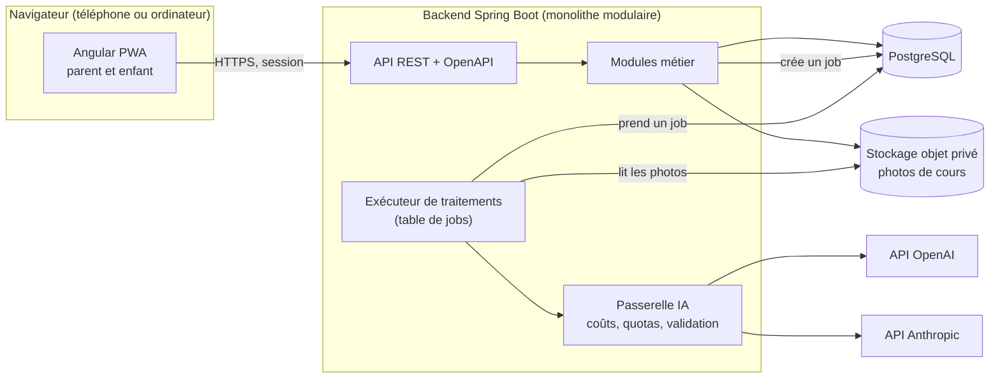
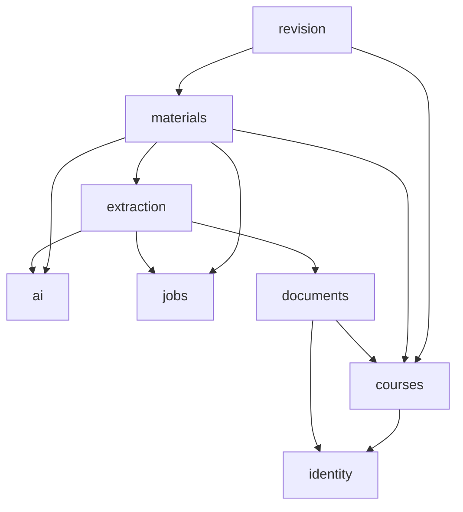
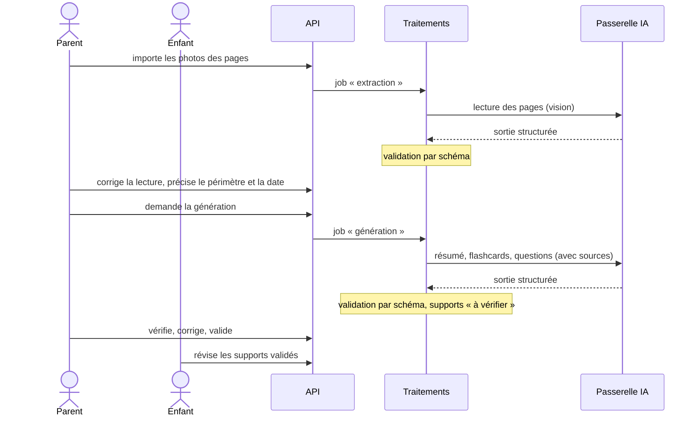

# Architecture — vue d'ensemble

État au 2026-09-23. Les décisions sont dans [`docs/adr/`](../adr/) ; ce document décrit la cible du MVP et ce qui reste ouvert.

## Principes

- **Un backend, une API.** Spring Boot expose une API REST documentée en OpenAPI, utilisée par le web aujourd'hui et réutilisable par un client mobile demain ([ADR 0002](../adr/0002-backend-spring-boot-monolithe-modulaire.md)). L'authentification des clients non navigateurs est à prévoir dans #11.
- **Un frontend web responsive.** Angular, installable en PWA ([ADR 0001](../adr/0001-frontend-angular-pwa.md)). Android et iOS viennent après, sans promesse de conversion automatique ([ADR 0003](../adr/0003-mobile-pwa-puis-evaluation.md)).
- **Le serveur décide.** Accès, validation parent, appels IA et coûts sont contrôlés côté serveur. Le navigateur ne détient aucune clé IA.
- **Le parent a le dernier mot.** Une correction du parent est conservée à chaque régénération.
- **Peu de pièces.** PostgreSQL pour les données et la file de traitements, un stockage objet privé pour les images. Pas de broker de messages ni de microservices au MVP.

## Composants

## Modules du backend

| Module | Responsabilité | Issues |
| --- | --- | --- |
| `identity` | Compte parent, session, profils enfants, appareils autorisés, appartenance familiale | #11, #22–#25 |
| `courses` | Matières, cours, échéances, périmètre à étudier | #26, #29 |
| `documents` | Import des pages, stockage privé, suppression | #12, #27 |
| `extraction` | Texte lu par page, corrections du parent | #28 |
| `materials` | Résumés, flashcards, questions, versions, validation parent, régénération | #30–#34 |
| `revision` | Séances, réponses, planning jusqu'à l'échéance | #35–#41 |
| `ai` | Passerelle fournisseurs, prompts versionnés, sorties structurées, coûts | #13, #21 |
| `jobs` | Traitements longs durables : statut, reprise, idempotence | #12 |

Dépendances autorisées entre modules (une flèche = « utilise l'interface publique de ») :

Un module n'accède pas aux tables d'un autre. Les règles de découpage exactes et leur contrôle automatique seront fixés avec #6.

## Frontières client / serveur

| Côté navigateur | Côté serveur uniquement |
| --- | --- |
| Écrans, navigation, état d'affichage, capture ou choix des photos | Contrôle d'accès de chaque ressource familiale |
| Client typé à partir du contrat OpenAPI (#10) | Clés et appels IA, prompts, plafond de dépense |
| Cache PWA limité aux fichiers de l'application | Stockage des photos et du texte extrait |
| Affichage des contenus générés comme texte, jamais comme HTML | Décision de ce que l'enfant peut voir (supports validés seulement) |

**Pas de données privées hors ligne au MVP.** Les réponses de l'API et les images privées portent `Cache-Control: no-store` ; le service worker ne met pas en cache les appels à l'API ; la déconnexion efface l'état local, notamment sur un appareil partagé.

**Accès des enfants** (décision #19). Un profil enfant n'a ni e-mail ni mot de passe. Le parent autorise un appareil depuis sa session ; l'enfant y ouvre son profil. Invariants, quel que soit le mécanisme retenu dans #11 et #24 :

- le parent peut révoquer un appareil à tout moment ;
- une session enfant ne voit que son propre profil et les supports validés de sa famille ;
- une session enfant ne déclenche aucun appel IA payant et aucune action réservée au parent ;
- toute action du parent redemande son authentification, y compris sur un appareil partagé.

## Flux d'un cours

- **Traitements longs.** Extraction et génération passent par une table de jobs dans PostgreSQL : statut, tentatives bornées, reprise après redémarrage. Chaque résultat d'appel IA est enregistré avant l'étape suivante et une clé d'idempotence limite les doubles appels ; un arrêt pendant un appel peut malgré tout le faire rejouer une fois, ce que le suivi des coûts doit refléter.
- **Validation parent obligatoire** (décision #19). Un support généré reste invisible pour l'enfant tant que le parent ne l'a pas validé.
- **Corrections préservées.** Chaque élément (carte, question, section de résumé) garde son origine : IA ou parent. Une régénération crée une nouvelle version et ne remplace que les éléments non corrigés (#34).
- **Contenu importé = donnée.** Le texte d'un cours et les photos elles-mêmes peuvent contenir des consignes piégées. Ils sont transmis à l'IA comme contenu délimité, jamais comme instruction ; les sorties sont validées par schéma ; aucune action n'est déclenchée par le contenu d'un cours.
- **Photos.** Les métadonnées (EXIF, dont la position GPS) sont retirées avant stockage et avant tout envoi à l'IA (#12).

## IA

- Fournisseurs de départ (décision #19) : **OpenAI et Anthropic**, derrière une interface commune, plus un fournisseur simulé pour les tests. Le fournisseur par défaut de chaque tâche (lecture, génération) sera choisi après l'évaluation sur données synthétiques (#21).
- Clés en variables d'environnement du serveur, jamais dans le dépôt, le frontend, les réponses ou les journaux.
- Chaque appel est tracé : fournisseur, modèle, version du prompt, jetons, coût estimé, durée, statut, identifiant de job. Le contenu des cours n'est pas journalisé.
- Plafond de dépense : mécanisme prévu dans #13, montant à fixer.
- Conditions de traitement des données par chaque fournisseur (conservation, région, absence d'entraînement sur les données) à vérifier avant d'envoyer de vrais cours (#11, #44).

## V1 et options futures

| MVP (V1) | Plus tard, sur décision |
| --- | --- |
| Web responsive, installable en PWA | Application Android/iOS via Capacitor ou client natif (#18) |
| En ligne uniquement pour les données privées | Révision hors ligne (quelles cartes, quand synchroniser) |
| Clé IA centrale côté serveur | Clés IA par famille |
| Une application déployée, une base | Montée en charge, services séparés si un besoin mesuré l'impose |

## Versions vérifiées le 2026-09-23

Figées dans les fichiers de build par #5, après nouvelle vérification.

| Outil | Version proposée | Justification |
| --- | --- | --- |
| Java | 21 (LTS) | Présent et utilisable dans l'environnement de travail des agents ; pris en charge par Spring Boot 4.1. Java 25 (LTS) est une montée de version à planifier une fois la CI (#15) en place. |
| Maven | 3.9 (via Maven Wrapper) | 3.9.11 présent |
| Spring Boot | 4.1.x | 4.1.1, dernière version stable sur Maven Central (4.2.0-M1 est un jalon) |
| Node.js | 24 (LTS) | Angular 22 accepte `^22.22.3`, `^24.15.0` ou `>=26` ; 24 est la LTS active |
| Angular | 22.1.x | 22.1.7 sur npm ; `@angular/pwa` 22.1.8 |
| PostgreSQL | à figer avec #9 | proposition, non vérifiée ici |

## Décisions restantes

| Décision | Proposition | Bloque |
| --- | --- | --- |
| Acceptation de l'ADR 0002 (monolithe modulaire, PostgreSQL, stockage objet) | voir l'ADR | #5, #6, #9, #12 |
| Hébergement et services payants | à proposer avec #16 | #16, #17 |
| Plafond mensuel de dépense IA | montant à fixer par le mainteneur | #13 |
| Fournisseur IA par défaut par tâche | après l'évaluation #21 | #28, #30–#32 |
| Conditions de traitement des données par les fournisseurs IA et conformité RGPD | à vérifier et faire valider | #11, #44 |
| Connexion du parent (e-mail seul ou aussi Google) | e-mail et mot de passe au MVP | #22 |
| Âges, langues et taille du pilote | à fixer dans #19 | #21, #44 |
| Compagnons, séries, accessoires dans le MVP | à fixer dans #19 et #20 | #20, #39 |
